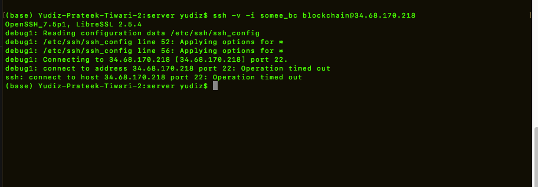
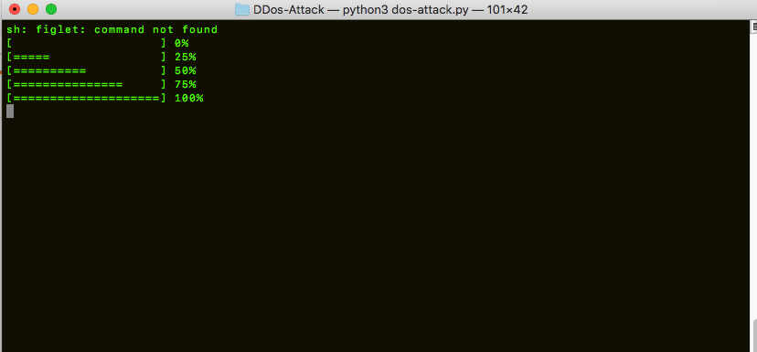
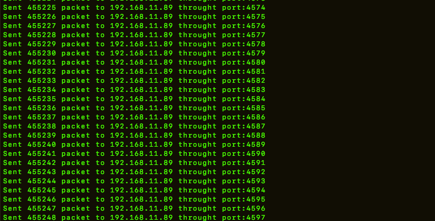

# DOS ATTACK Example 

    Attack on network.

## Requirements

    python 3.7 

## Run   

    python dos-attack.py

## ADD VICTIMS IP AND PORT

    IP VICTIM : 
    PORT : 

## OUTPUTS
```
To run it
```


```
Showing progress
```

  

```
packets transfer
```



```
check victims network manager
```

